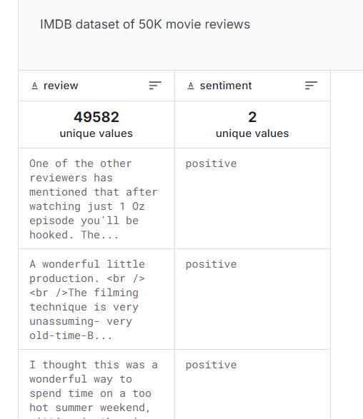
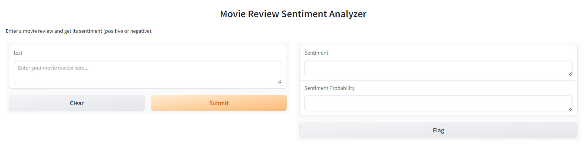
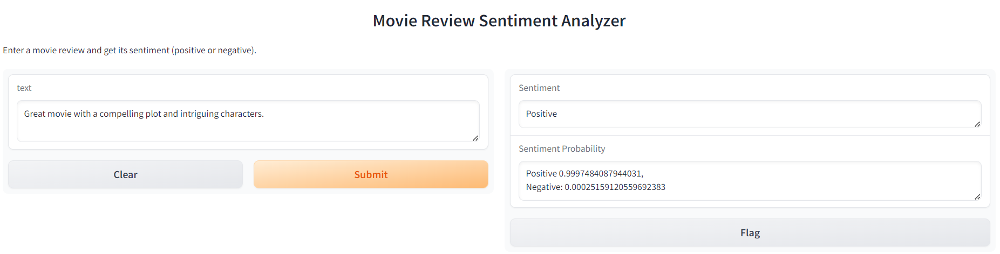

# LSTM for Sentiment Analysis
###  *Using IMDB movie reviews*

[](https://drive.google.com/drive/folders/1zgEkwcCkkZwmOhoivt9-0cMcRoVYSBQy?usp=sharing]

## Project Description 
Sentiment analysis on movie reviews using a Long Short-Term Memory (LSTM) model. The project contains 2 notebooks, one for training the model and one for directly using the trained model.

## Dataset
Dataset used is the IMDB dataset for movie reviews: https://www.kaggle.com/datasets/lakshmi25npathi/imdb-dataset-of-50k-movie-reviews

<div align = "center">
    
</div>

## Required Libraries
```
tensorflow
nltk
pandas
numpy
sklearn
matplotlib
ipython
keras
```
## Training
1. Text is preprocessed by removing HTML tags, converting to lowercase, removing stop words, and lemmatizing.
```
def preprocess_text(text):
  # Remove HTML tags
  text = re.sub('<[^<]+?>', '', text)
  # Convert to lowercase
  text = text.lower()
  # Tokenize the text
  tokens = nltk.word_tokenize(text)
  # Remove stopwords and punctuation
  stop_words = set(stopwords.words('english'))
  tokens = [token for token in tokens if token.isalnum() and token not in stop_words]
  # Lemmatize the words
  tokens = [lemmatizer.lemmatize(token) for token in tokens]
  # Join the tokens back into a string
  processed_text = ' '.join(tokens)
  return processed_text
```
2. Text is then tokenized and padded to fixed length sequences.
```
from tensorflow.keras.preprocessing.text import Tokenizer
from keras.preprocessing.sequence import pad_sequences

Tokenizer=Tokenizer(num_words=5000)
Tokenizer.fit_on_texts(processed_text)
tokens = Tokenizer.texts_to_sequences(processed_text)

x = pad_sequences(tokens , maxlen=100)
```
3. The labels are encoded as 0 or 1 for negative and positive sentiment, respectively.
```
labels = reviews['sentiment']
encoded_labels = [1 if label == "positive" else 0 for label in labels]
```
4. An LSTM model is built and trained on the training data.
5. The model is then saved and evaluated on the testing data

## Inference
1. Trained model is unzipped and loaded along with the tokenizer.
```
import tensorflow as tf
model = tf.keras.models.load_model('/content/my_sentiment_model.keras')

import pickle
with open('/content/tokenizer.pickle', 'rb') as handle:
    tokenizer = pickle.load(handle)
```
2. Text is tokenized and padded for the model to be able to process it like in training.
3. A function called predict_sentiment is defined to to make the models predictions easier to understand.
```
def predict_sentiment(text):
   padded_sequence = preprocess_given_text(text)

   prediction = model.predict(padded_sequence)

   if prediction[0][0] > prediction[0][1]:
       sentiment = "Negative"
       probability = prediction[0][0]
       return sentiment, (f"Negative {probability}, \nPositive: {1 - probability}")
   else:
       sentiment = "Positive"
       probability = prediction[0][1]
       return sentiment, (f"Positive {probability}, \nNegative: {1 - probability}")
```
4. Finally,a user interface is made for the sentiment analyzer. The interface takes movie review as input and outputs the sentiment and probability.

<div align = "center">
    
</div>

5. The user interface is made with gradio so it will be publicly available for 72 hours on a link.

<div align = "center">
    
</div>


